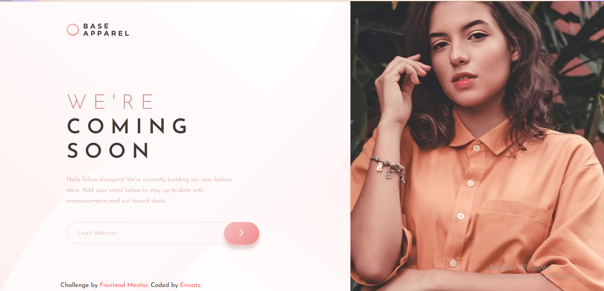

# Frontend Mentor - Base Apparel coming soon page solution

This is a solution to the [Base Apparel coming soon page challenge on Frontend Mentor](https://www.frontendmentor.io/challenges/base-apparel-coming-soon-page-5d46b47f8db8a7063f9331a0). Frontend Mentor challenges help you improve your coding skills by building realistic projects. 

## Table of contents

- [Overview](#overview)
  - [Welcome](#Welcome!-👋)
  - [The challenge](#the-challenge)
  - [Where to find Everything](#where-to-find-everything)
  - [Screenshot](#screenshot)
  - [Links](#links)
- [My process](#my-process)
  - [Built with](#built-with)
- [Author](#author)

## Overview

### Welcome! 👋

Thanks for checking out this front-end coding challenge.

[Frontend Mentor](https://www.frontendmentor.io) challenges help you improve your coding skills by building realistic projects.

### The challenge

Users should be able to:

- View the optimal layout for the site depending on their device's screen size
- See hover states for all interactive elements on the page
- Receive an error message when the `form` is submitted if:
  - The `input` field is empty
  - The email address is not formatted correctly

### Where to find everything

Your task is to build out the project to the designs inside the `/design` folder. You will find both a mobile and a desktop version of the design. 

The designs are in JPG static format. Using JPGs will mean that you'll need to use your best judgment for styles such as `font-size`, `padding` and `margin`. 

If you would like the design files (we provide Sketch & Figma versions) to inspect the design in more detail, you can [subscribe as a PRO member](https://www.frontendmentor.io/pro).

You will find all the required assets in the `/images` folder. The assets are already optimized.

There is also a `style-guide.md` file containing the information you'll need, such as color palette and fonts.

### Screenshot

## Solution

### Links

- Solution URL: [github](https://github.com/einsatz3012/base-apparel-coming-soon)
- Live Site URL: [Base Apparel Coming Soon](https://einsatz3012.github.io/base-apparel-coming-soon/)

## My process

### Built with

- CSS custom properties
- CSS Grid
- Desktop-first workflow

## Author

- Website - [Rushikesh Patil](https://www.linkedin.com/in/rushikesh-patil-01/)
- Frontend Mentor - [einsatz3012](https://www.frontendmentor.io/profile/einsatz3012)

